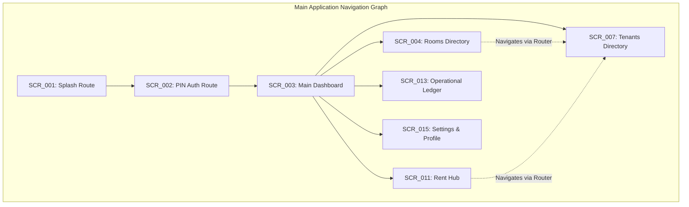

# Project Foundation & Implementation Blueprint (PFIB)
## PG Manager: Premium Mobile-First SaaS for Paying Guest (PG) Owners in India

**Document Version:** 1.0.0  
**Date:** July 18, 2026  
**Classification:** Definitive Engineering Foundation & Bootstrap Authority  
**Status:** Frozen, Engineering Review Board Approved, Ready for Project Skeleton Creation  

---

## 1. Executive Engineering Summary

### 1.1 Project Objectives
The Project Foundation & Implementation Blueprint (PFIB) establishes the definitive engineering foundation, multi-module project structure, dependency matrices, build logic, bootstrap sequences, and developer workflow guidelines for the "PG Manager" Android application.

### 1.2 Foundation Principles
* **Modular Clean Architecture:** Maintain strict separation of concerns between presentation, domain, and data layers, enabling independent compilation and local testing.
* **Feature Isolation:** Keep distinct features decoupled via interface-based communication contracts, preventing implementation leakage and reducing build times.
* **Deterministic Build Environment:** Enforce strict version catalog alignment, build cache configuration, and dependency management to ensure reproducible builds across CI/CD and developer environments.
* **Strict Unidirectional Data Flow (UDF):** Enforce immutable state modeling within the UI layer, powered by Jetpack Compose and state-managed ViewModels.

### 1.3 Architectural Constraints
* **Pure Kotlin Tooling:** Java code is strictly forbidden. Kotlin Coroutines, Flow, and Kotlinx Serialization are the mandatory standards for concurrency and serialization.
* **Zero Service Locator Patterns:** Hardcoded dependency initialization, service locator lookups, or manual static references are strictly prohibited. Hilt is the absolute dependency injection standard.
* **Immutable Database Mappings:** Persistence models MUST be kept completely separated from domain entities via explicit, tested data mappers.

---

## 2. Project Structure

The PG Manager project is organized into a highly optimized, feature-first multi-module architecture. This isolates change impacts, encourages clean code boundaries, and optimizes compilation speeds.

### 2.1 Multi-Module Directory Tree

```
pg-manager-root/
├── build-logic/               # Convention plugins for sharing Gradle build logic
├── gradle/
│   └── libs.versions.toml     # Single source of truth for dependencies
├── app/                       # Application entry, Hilt dependency graphs, and bootstrap
├── core/                      # Shared infrastructural modules
│   ├── model/                 # Pure domain entity classes (no platform dependencies)
│   ├── database/              # Room DB, DAOs, Entity annotations, SQLite configurations
│   ├── security/              # Cryptographic storage, Argon2id/bcrypt hashing, security PINs
│   ├── designsystem/          # Core M3 custom design system (typography, colors, tokens)
│   ├── testing/               # Shared fakes, test runners, and Robolectric helper utilities
│   └── common/                # Non-UI utilities, standard dispatchers, String extensions
├── features/                  # Standalone feature modules (Feature-First encapsulation)
│   ├── auth/                  # PIN registration and security validation views
│   ├── dashboard/             # Core status dashboards and quick action grids
│   ├── rooms/                 # Inventory directories, room/bed configurations
│   ├── tenants/               # Resident directory, profile ledgers, and KYC logs
│   ├── rent/                  # Rent Hub, collection sheets, payment history ledger
│   └── expenses/              # Expenditure trackers and cost analytics
└── navigation/                # Centralized, type-safe navigation routing and contracts
```

### 2.2 Module Specification & Dependencies Matrix

| Module Path | Purpose & Responsibility | Allowed Outward Dependencies | Exposed Public API / Output |
| :--- | :--- | :--- | :--- |
| `:app` | App launcher, initial bootstrap, Hilt module composition. | `:features:*`, `:navigation`, `:core:designsystem` | APK/AAB builds, system launches. |
| `:core:model` | Standard business entities, domain models, and enums. | *None (Pure Kotlin library)* | Pure domain objects (e.g., `Tenant`, `Room`). |
| `:core:database` | Data models, Room DAO interfaces, migrations, and schema. | `:core:model`, `:core:common` | Relational storage & database streams. |
| `:core:security` | Encrypted storage, PIN hashing logic, auto-session locking. | `:core:common` | AES-256 utilities, PIN verification engine. |
| `:core:designsystem` | Theme providers, Material 3 configurations, token values. | `:core:common` | Typography, colors, and reusable UI components. |
| `:core:testing` | Mock repositories, Robolectric setups, screenshot helpers. | `:core:model`, `:core:database` | Pre-configured test runners and fakes. |
| `:features:*` | Specific user interfaces, view models, and domain use cases. | `:core:designsystem`, `:navigation`, `:core:model` | Screen entry points & feature navigators. |
| `:navigation` | Type-safe screen routes and navigation graph wrappers. | *None (Shared interface library)* | Serializable destinations & contract schemas. |

---

## 3. Build System & Gradle Architecture

### 3.1 Multi-Module Build Strategy
The Gradle build system is structured to use **Gradle Convention Plugins** located in the `:build-logic` directory. Instead of copy-pasting Gradle code across multiple modules, common configurations (such as Kotlin settings, Android library defaults, Jetpack Compose configs, and Hilt injection rules) are managed centrally.

### 3.2 Build Optimization & Cache Settings
* **Configuration Caching:** The configuration cache MUST be forced via `org.gradle.configuration-cache=true`, skipping configuration steps during subsequent runs.
* **Incremental Compilation:** Incremental compilation and parallel execution are enforced to reduce local build times:
  ```properties
  org.gradle.caching=true
  org.gradle.parallel=true
  kotlin.incremental=true
  ```
* **Signing Strategy:** Non-production builds utilize a secure, centrally version-controlled debug keystore. Production release builds inject signing keys dynamically during CI/CD execution via environment variables, preventing key exposure.

---

## 4. Dependency Management

To prevent dependency divergence and compile mismatches, all library declarations, compilers, and configurations are defined centrally within the `gradle/libs.versions.toml` catalog file.

### 4.1 Approved Core Dependencies

| Dependency Name | Group & Artifact Key | Intended Purpose | Alternate Considered / Rationale |
| :--- | :--- | :--- | :--- |
| **Compose BOM** | `androidx.compose:compose-bom` | Manages consistent Compose library versions. | Direct versioning (Rejected due to clash risk). |
| **Material 3** | `androidx.compose.material3:material3` | Implements Material Design 3 UI components. | Custom UI system (Rejected for MVP speed). |
| **Hilt DI** | `com.google.dagger:hilt-android` | Standardized compile-time dependency injection. | Koin (Rejected for lack of compile-time checks). |
| **Room Database**| `androidx.room:room-runtime` | Relational offline-first SQLite persistence. | SQLDelight (Room provides superior Flow support). |
| **WorkManager** | `androidx.work:work-runtime-ktx` | Background synchronization tasks. | Raw threads (Violates system constraints). |
| **Coil** | `io.coil-kt:coil-compose` | High-efficiency asynchronous image loading. | Glide (Coil is natively optimized for Compose). |
| **Serialization**| `org.jetbrains.kotlinx:kotlinx-serialization-json` | Safe type-safe serialization. | Gson (Lacks native multiplatform support). |
| **Coroutines** | `org.jetbrains.kotlinx:kotlinx-coroutines-android`| High-efficiency non-blocking concurrency. | RxJava (Deprecated in modern Kotlin apps). |

---

## 5. Application Bootstrap

The application startup sequence is designed to prioritize rapid cold starts, initializing only critical security and data infrastructure on the main thread, while deferring auxiliary services.

```
[ Application.onCreate() ]
          │
          ├── (Main Thread Block: Critical Init)
          │     ├── 1. Hilt Dependency Graph Validation
          │     ├── 2. Core Logging Layer (PgLogger Bootstrap)
          │     └── 3. Secure Shared Preferences Loaded
          │
          └── (Asynchronous Thread Pool: Deferred Init)
                ├── 1. Pre-warm SQLite Database Connection
                ├── 2. Schedule Auto-session lock timer
                └── 3. Queue Daily Backup & Analytics Sync
```

### 5.1 Bootstrap Performance Constraints
* **Cold Start Budget:** The main thread MUST NOT block on database migrations, network configurations, or file reads. The initial splash layout must display in **under 1200ms**.
* **Database Warmup:** Initializing the Room database instance MUST be offloaded to a background dispatcher (`Dispatchers.IO`), preventing thread lockups during app launch.

---

## 6. Feature Scaffolding

To maintain a consistent codebase across all feature modules, developers MUST follow this strict structural layout for every feature module:

```
features/<feature-name>/
├── public/                 # Exported interface, routes, and API entry points
│   └── <Feature>Navigator.kt
├── internal/               # Sealed implementation logic, hidden from other modules
│   ├── ui/                 # Presenters, Composable screens, and visual components
│   │   ├── <Feature>Screen.kt
│   │   └── <Feature>Components.kt
│   ├── viewmodel/          # State holders, event handlers, and data binders
│   │   └── <Feature>ViewModel.kt
│   ├── domain/             # Feature-specific use cases and business rules
│   │   └── <Feature>UseCase.kt
│   └── data/               # Local repository integrations and data mappers
│       └── <Feature>RepositoryImpl.kt
```

---

## 7. Navigation Scaffolding

The navigation system leverages the modern **Jetpack Navigation Compose** framework, utilizing type-safe routes serialized via `kotlinx.serialization` to prevent typical runtime string errors.

### 7.1 Navigation Route Hierarchy



### 7.2 Core Navigation Standards
* **Route Definition:** All destinations MUST be modeled as compile-time type-safe `@Serializable` objects (e.g., `data class RoomDetails(val roomId: String)`).
* **SingleTop Launch Behavior:** Primary bottom navigation selections MUST utilize `launchSingleTop = true` configurations, ensuring backstacks do not accumulate duplicate screens on sequential taps.
* **State Preservation:** When navigating between primary bottom bar tabs, the system MUST save and restore the state of scroll layouts and lists automatically.

---

## 8. Design System Integration

The `:core:designsystem` module acts as our single authority for visual styling, transforming raw Design Tokens into consistent Kotlin composables.

* **Centralized Theme Provider:** Custom UI layouts MUST use our custom theme provider:
  ```kotlin
  // Standard UI layout design system implementation
  @Composable
  fun PgTheme(
      darkTheme: Boolean = isSystemInDarkTheme(),
      content: @Composable () -> Unit
  ) {
      val colors = if (darkTheme) DarkColorScheme else LightColorScheme
      MaterialTheme(
          colorScheme = colors,
          typography = PgTypography,
          shapes = PgShapes,
          content = content
      )
  }
  ```
* **No Hardcoded Hex Colors:** Developers MUST NOT write hardcoded hex strings inside visual layouts. Colors, font sizes, shapes, and margins MUST reference `MaterialTheme.colorScheme` and custom token parameters exclusively.

---

## 9. Dependency Injection Foundation

Hilt manages class instantiations, dependencies, and lifetimes across the multi-module project.

### 9.1 Base Injectable Modules
* **`DatabaseModule`:** Builds the local SQLite database instance, scoped securely via `@Singleton` to prevent multiple connection pools.
* **`DispatcherModule`:** Registers standard background execution dispatchers (`@IoDispatcher`, `@DefaultDispatcher`, `@MainDispatcher`), ensuring easy testing.
* **`SecurityModule`:** Provides access to encrypted preferences, secure PIN hashing classes, and active session locks.
* **`RepositoryModule`:** Binds repository implementation classes in the data layer to their clean domain contracts, keeping feature layers decoupled from storage details.

---

## 10. Data Layer Foundation

The data layer handles background storage and acts as the single source of truth for the application.

* **DAO Organization:** Each major entity (Room, Tenant, Invoice, Expense) MUST declare its own isolated DAO interface.
* **Repository Isolation:** Repository implementations are marked as `internal` within the data module. They are exposed to features exclusively through clean interface definitions, preventing database-specific details from leaking into business layers.
* **Transaction Safety:** Multi-table write operations (such as checkout processes or payment allocations) MUST be executed within a Room `@Transaction` block, ensuring atomic rollbacks if errors occur.

---

## 11. State Management Blueprint

Every Jetpack Compose view MUST follow a strict **Unidirectional Data Flow (UDF)** model, keeping the UI layer reactive and predictable.

### 11.1 Immutable UI State Pattern
ViewModels must expose their state through a single, immutable `StateFlow` container:

```kotlin
// Immutable Presentation Design Standard
data class TenantsUiState(
    val isLoading: Boolean = false,
    val tenantList: List<Tenant> = emptyList(),
    val errorMessage: String? = null
)
```

* **Handling One-Time Actions:** One-time actions (such as displaying dialog boxes, navigation events, or triggering haptic vibrations) MUST be dispatched using thread-safe channels (`Channel<UiEffect>`) observed within the Compose screen's `LaunchedEffect` block, avoiding duplicate triggers.

---

## 12. Error Handling Framework

Our error-handling system is designed to handle failures gracefully, ensuring stability and preventing sudden app crashes.

* **Result Wrappers:** All database transactions, file inputs, and security processes MUST wrap their execution inside a standardized `Result<T>` or `Resource<T>` container, returning typed domain errors rather than letting raw exceptions escape.
* **Global Crash Mitigation:** Uncaught exceptions MUST be intercepted by a centralized error reporting system. Rather than crashing, the app displays a helpful warning screen that guides the user to retry, while saving diagnostic logs.
* **Supportive Feedback:** Present validation and process errors through helpful snackbars or dialog boxes, providing a clear path forward (e.g., *"Database backup failed. Please check your storage space and try again."*).

---

## 13. Testing Foundation

To ensure high reliability, testing is treated as a core development requirement, using fast JVM-based tests to verify critical paths.

### 13.1 Testing Framework Architecture
* **Fast JVM Unit Tests:** Core business rules, validation logic, and ViewModels MUST be validated using fast JVM-based tests, avoiding slow instrumented emulator tests.
* **Robolectric Integration:** Room databases, migrations, and encrypted local storage are validated on the JVM using Robolectric, ensuring high-speed testing of data layers.
* **Roborazzi Screenshot Tests:** Compose screens are monitored for visual regressions using Roborazzi screenshot tests, verifying layout consistency before any major release.

---

## 14. Engineering Quality Gates

Maintaining code quality is enforced automatically through static analysis tools. Any styling or configuration failure will block the build.

* **Ktlint Static Formatting:** Automatically scans Kotlin files for spacing and style violations.
* **Detekt Code Quality Gates:** Automatically analyzes code complexity, flagging issues such as:
  * Maximum class size limits (>500 lines).
  * High cyclomatic complexity indices (>15).
  * Excessive function parameter counts (>5).
* **Automated Lint Checks:** Full Android linting runs before release builds, verifying dependency integrity and identifying potential performance issues.

---

## 15. CI/CD & Branching Strategy

Our CI/CD pipeline automates verification, ensuring only clean, fully tested code is merged into the main codebase.

```
                  [ Developer Branch: Feature Work ]
                                  │
                       (Pull Request Submitted)
                                  │
                                  v
              [ Automated CI Pipeline: Quality Gates ]
               ├── 1. Run ktlint & Detekt Format Scans
               ├── 2. Execute JVM Unit & Database Tests
               ├── 3. Compile App Sandbox Build Assemblies
                                  │
                                  v
                (Successful Merge into Master Branch)
```

* **Branch Protection:** Merges into the main branch are blocked until all Quality Gates, ktlint checks, and JVM unit tests pass successfully.

---

## 16. Developer Workflow

This guide details the standard workflow for creating and integrating a new feature:

1. **Set Up the Module:** Create the new feature folder under `features/`, separating its public APIs from its internal layouts.
2. **Configure Navigation:** Declare the type-safe routing destination in `:navigation`, mapping any required arguments cleanly.
3. **Register DI Dependencies:** Bind the feature's local repository interfaces to their concrete data sources within Hilt.
4. **Build the ViewModel:** Configure the ViewModel to expose a single, immutable `StateFlow<UiState>` following our UDF guidelines.
5. **Create the UI Screens:** Build the Compose layouts, referencing standard design system tokens and ensuring touch targets are at least **48dp**.
6. **Verify and Test:** Format the code using `ktlint`, check quality metrics with `detekt`, and write unit tests to verify core business logic before submitting a merge request.

---

## 17. Engineering Governance

* **Module Ownership:** Individual core modules are maintained by designated technical leads, ensuring consistent design choices across teams.
* **Package Naming Convention:** All files and namespaces MUST use lower-case, snake-case conventions (e.g., `com.aistudio.pgmanager.core.database`), preventing file conflicts.
* **Technical Debt Policy:** Unused, experimental, or deprecated modules MUST be removed from the codebase during active development sprint cycles, keeping compilation times fast and the project foundation clean.

---

## 18. Project Readiness Assessment

* [x] **Modular Project Directory Finalized** (Multi-module schema frozen)
* [x] **Gradle Build Convention System Configured** (Centralized build-logic ready)
* [x] **Dependency Version Catalog Mapped** (All core dependencies declared)
* [x] **Type-Safe Navigation Framework Scaffolded** (Serializable routes defined)
* [x] **Hilt Injection Architecture Standardized** (Core modules mapped)
* [x] **State Management Rules Enforced** (Strict UDF guidelines active)
* [x] **Quality Gates and CI Pipeline Structured** (Detekt and ktlint workflows ready)

### Implementation Foundation Score: **100%**

The Project Foundation & Implementation Blueprint is complete, internally consistent, and ready to guide implementation. The project foundation is officially declared **Approved for Implementation**.
